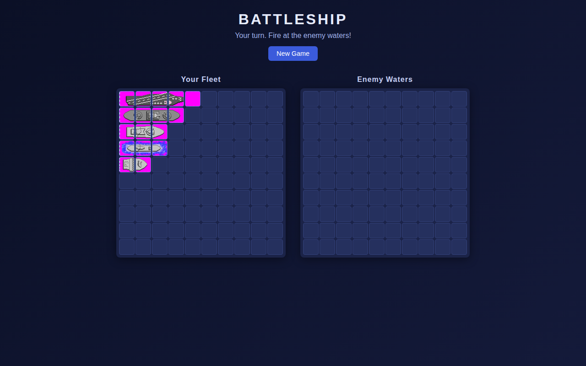
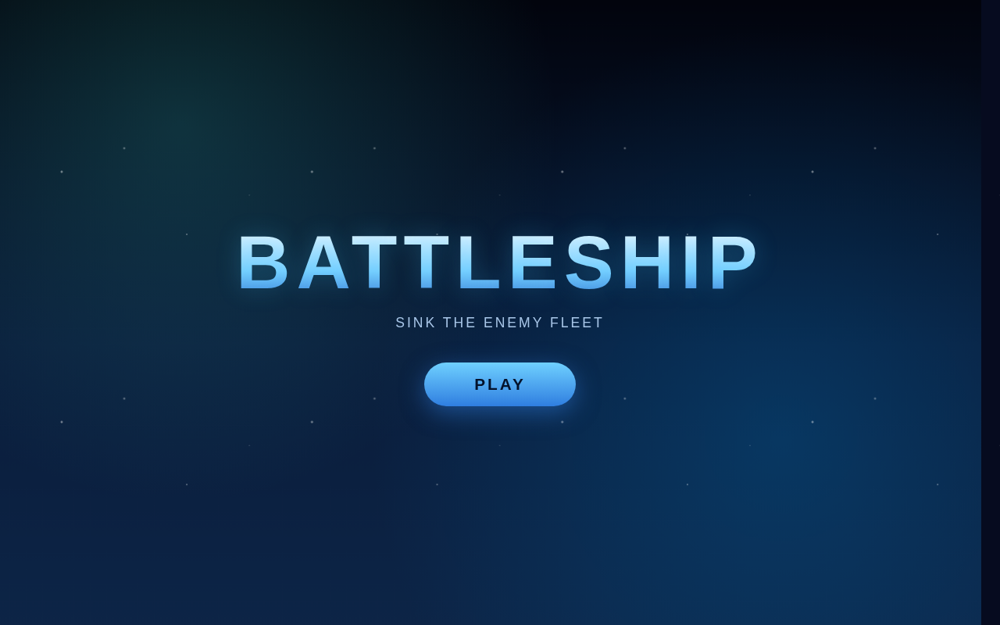
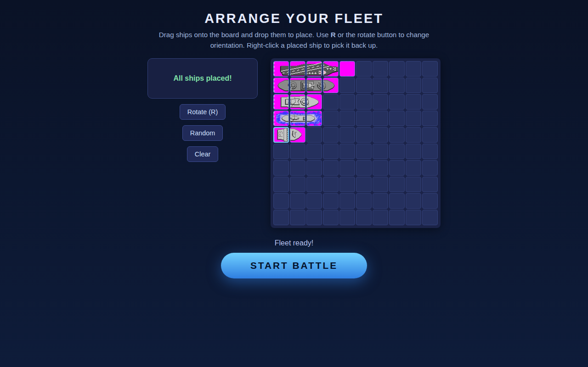

# ⚓ Battleship

A classic **Battleship** duel against a smart computer opponent, built as a fast, dependency-light browser game with custom ship sprites, sound effects, and background music.

> **Try it live:** [**https://sid2169.github.io/battleship/**](https://sid2169.github.io/battleship/)

[](https://sid2169.github.io/battleship/)

---

## 🎮 Play the game

Click the screenshot above (or the link) to jump straight into the live game. The flow is:

1. **Home screen** — hit **Play**
2. **Deploy your fleet** — drag or click ships from the palette onto your 10×10 board, rotate with the **R** key, or hit **Randomize** / **Reset**
3. **Battle** — take turns firing at the enemy's hidden waters until one fleet is sunk

| Home | Setup | Battle |
| :---: | :---: | :---: |
| [](https://sid2169.github.io/battleship/) | [](https://sid2169.github.io/battleship/) | [](https://sid2169.github.io/battleship/) |

---

## ✨ Features

- **Classic 10×10 Battleship** with the canonical five-ship fleet (**17 total cells**)
- **Hunt-and-target computer AI** (parity hunting + line-extension targeting) that reliably beats random play
- **Drag-and-drop or click-to-place** fleet setup, with live placement preview, rotation (**R**), randomize, and reset
- **Origin-shifted ship sprites** (one frame per cell) rendered on individual board cells
- **Background music & sound effects** (fire / hit / miss), unlocked on first interaction
- **Enemy fleet kept hidden** until game over — then *both* fleets are revealed so it's clear each side fielded the same five ships
- **Click-safe turns** — a shot fired while the computer is thinking is queued and delivered on your next turn, never silently lost
- **ES modules + webpack 5**, Jest-tested game logic, deployed automatically to GitHub Pages in one command

---

## 🧱 Tech stack

| Concern | Tool |
| --- | --- |
| Language | Vanilla JavaScript (ES modules) |
| Bundler | [webpack 5](https://webpack.js.org/) + Babel |
| Styling | Hand-written CSS (`src/styles.css`) |
| Testing | [Jest](https://jestjs.io/) + jsdom |
| Deployment | [gh-pages](https://github.com/tschaub/gh-pages) → GitHub Pages |
| Assets | CC0 ship sprites & audio (see [`ASSETS_ATTRIBUTION.md`](ASSETS_ATTRIBUTION.md)) |

---

## 📁 Project structure

```
battleship/
├── src/
│   ├── index.js              # App entry: screen routing, turn loop, wiring
│   ├── index.html            # Single-page shell (home / setup / game screens)
│   ├── styles.css            # All styling
│   ├── core/                 # Framework-agnostic game logic (pure JS)
│   │   ├── Ship.js           # Ship model (length, name, hits, sunk state)
│   │   ├── Board.js          # Grid, placement, shot handling, fleet victory
│   │   ├── Game.js           # Orchestrates human/computer turns, fleet, winner
│   │   └── computerAI.js     # Hunt-and-target AI implementation
│   ├── ui/                   # Rendering & interaction layers
│   │   ├── DOM.js            # Board rendering (cells, hit/miss markers, reveal)
│   │   ├── ships.js          # Maps ship names → sprite URLs; background slicing
│   │   └── setup.js          # Fleet setup screen (palette, drag/place/rotate)
│   ├── audio/
│   │   └── audio.js          # AudioManager: looping music + one-shot SFX
│   └── assets/
│       ├── ships/            # CC0 ship sprite sheets
│       └── audio/            # CC0 music & sound effects
├── tests/                    # Jest unit + integration tests
├── docs/                     # README screenshots
└── webpack.config.js
```

### Layering

The code is split into two clean layers:

- **Core (`src/core/`)** — pure logic with **zero DOM references**. `Ship`, `Board`, `Game`, and `ComputerAI` are fully testable in isolation and know nothing about the UI.
- **UI (`src/ui/`, `src/index.js`, `src/audio/`)** — renders the core state to the screen and translates user input into core actions.

`src/index.js` is the thin orchestrator: it owns the three screens, the turn loop (human fires → computer fires after a short delay), and the game-over reveal.

---

## 🚢 Game architecture

### The model

- `Ship` — a length and a name; records which **index**es have been hit and reports when it is sunk.
- `Board` — a `10×10` grid plus a `Set` of fired shots. `placeShip` validates bounds/overlap, `receiveAttack` resolves a hit or miss, and `allShipsSunk()` decides fleet victory.
- `Game` — builds one `Board` for each side with the standard **FLEET**:

| Ship | Length |
| --- | --- |
| Carrier | 5 |
| Battleship | 4 |
| Cruiser | 3 |
| Submarine | 3 |
| Destroyer | 2 |
| **Total** | **17** |

It enforces alternating turns, applies attacks, and sets `winner` the moment either `allShipsSunk()` returns true.

### The computer AI (`src/core/computerAI.js`)

A **hunt-and-target** strategy that maximizes the computer's win rate:

- **Hunt phase** — probes untried cells using a **parity checkerboard**, which guarantees every even-length ship is discovered while never wasting a shot on a cell no ship can occupy.
- **Target phase** — once a hit lands, it explores orthogonal neighbours; once two adjacent hits reveal the ship's orientation, it extends the line (far end first) until the ship is sunk.
- **No wasted shots** — cells belonging to already-sunk ships are excluded from future targeting.

Measured over ~2000 simulated games, this AI sinks the full fleet in ~58 shots on average versus ~95 for pure random firing.

### Rendering (`src/ui/DOM.js` + `ships.js`)

- `renderBoard` rebuilds a board container, tagging every cell with `data-row`/`data-col`.
- The **enemy** board hides its ships (`revealed: false`) until game over.
- Each ship is drawn by slicing its **sprite sheet** to 34px-per-cell frames via `background-size`/`background-position`, so a single image renders the full ship across its cells.

### Audio (`src/audio/audio.js`)

- Browsers block autoplay, so `AudioManager` **unlocks on first interaction** (`pointerdown`/`keydown`).
- `playMusic` switches between looping menu/battle tracks; `playSfx` plays one-shot fire/hit/miss clips.

---

## 💻 Getting started

```bash
# Install dependencies
npm install

# Start the dev server (http://localhost:3000)
npm start

# Run tests (watch mode)
npm test

# Run tests once with coverage
npm run test:ci

# Production build into dist/
npm run build
```

---

## 🚀 Deployment (GitHub Pages)

The live site is served from the **`gh-pages`** branch at the project subpath
`https://sid2169.github.io/battleship/`. To rebuild the site and push the new
build live **in one command**:

```bash
npm run deploy
```

Under the hood, `predeploy` runs `npm run build` (webpack production, emits to
`dist/`) and then `deploy` runs `gh-pages -d dist --nojekyll`, which publishes
the `dist/` contents to the `gh-pages` branch. GitHub Pages picks up the new
commit automatically.

- `webpack.config.js` sets `publicPath: '/battleship/'` so content-hashed
  JS/audio assets resolve correctly under the project subpath.
- `--nojekyll` stops GitHub Pages from running Jekyll over the static output.

---

## 🧪 Testing

- **Unit tests** cover `Ship`, `Board`, and `Game` (placement, attacks, win/loss).
- **AI tests** (`tests/computerAI.test.js`) verify parity hunting, adjacent targeting, line extension, no-wasted-shots, and that smart beats random.
- **Integration** (`tests/gameflow.test.js`) covers the Start-Battle flow; `tests/DOM.test.js` covers board rendering and the game-over fleet reveal.

```bash
npm run test:ci   # 7 suites, all passing with coverage
```

---

## 📄 Attribution

Ship sprites, music, and sound effects used in this project are **CC0** licensed.
See [`ASSETS_ATTRIBUTION.md`](ASSETS_ATTRIBUTION.md) for full credits and links.

---

## 📜 License

ISC. See `package.json`.
